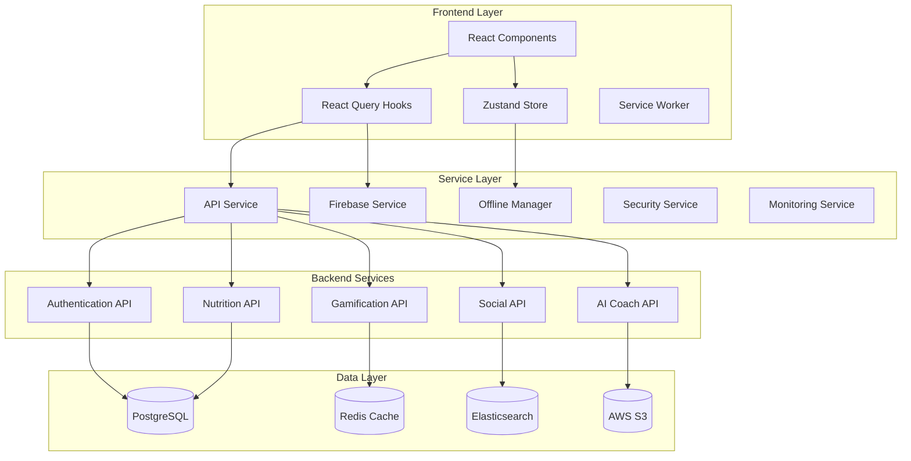

# Integration Points Documentation

## Overview

This document outlines the key integration points in the Diet Game application, detailing how different systems, services, and components interact to provide a cohesive user experience. The application follows a modern microservices architecture with clear separation of concerns.

## Table of Contents

1. [Architecture Overview](#architecture-overview)
2. [Frontend Integration Points](#frontend-integration-points)
3. [Backend Integration Points](#backend-integration-points)
4. [Database Integration](#database-integration)
5. [External Service Integration](#external-service-integration)
6. [Real-time Communication](#real-time-communication)
7. [State Management Integration](#state-management-integration)
8. [Security Integration](#security-integration)
9. [Monitoring and Analytics](#monitoring-and-analytics)
10. [Offline Support Integration](#offline-support-integration)

## Architecture Overview



## Frontend Integration Points

### 1. Component-Service Integration

**Location**: `src/components/` ↔ `src/services/`

**Integration Pattern**: Service injection through React hooks

```typescript
// Example: Task completion integration
const TaskComponent = () => {
  const { completeTask } = useNutriActions();
  const { mutate: completeTaskMutation } = useCompleteTask(userId);
  
  const handleTaskComplete = async (taskId: number) => {
    // Local state update (optimistic)
    await completeTask(taskId, 'meal', 1);
    
    // Server sync
    completeTaskMutation({ taskId, taskType: 'meal', streak: 1 });
  };
};
```

**Key Integration Points**:
- Task completion flows
- User profile updates
- Progress tracking
- Real-time notifications

### 2. State Management Integration

**Location**: `src/store/nutriStore.ts` ↔ All components

**Integration Pattern**: Zustand store with React Query synchronization

```typescript
// Store integration with external services
export const useNutriStore = create<NutriState>()(
  subscribeWithSelector(
    persist(
      immer((set, get) => ({
        // Local state management
        updateProgress: (updates) => set((state) => {
          Object.assign(state.progress, updates);
          state.lastSyncTime = Date.now();
        }),
        
        // Integration with offline manager
        completeTask: async (taskId, taskType, streak) => {
          // Queue for offline sync
          get().addPendingUpdate({
            id: `task-${taskId}-${Date.now()}`,
            type: 'progress',
            data: newProgress,
            timestamp: Date.now(),
          });
        },
      }))
    )
  )
);
```

### 3. React Query Integration

**Location**: `src/hooks/useNutriQueries.ts` ↔ API services

**Integration Pattern**: Centralized data fetching with caching

```typescript
// Optimistic updates with rollback
export const useUpdateUserProgress = (userId: string) => {
  return useMutation({
    mutationFn: (updates: Partial<UserProgress>) => 
      retryRequest(() => NutriQuestAPI.updateUserProgress(userId, updates)),
    onMutate: async (updates) => {
      // Optimistic update
      await queryClient.cancelQueries({ queryKey: queryKeys.userProgress(userId) });
      const previousProgress = queryClient.getQueryData(queryKeys.userProgress(userId));
      
      if (previousProgress) {
        queryClient.setQueryData(queryKeys.userProgress(userId), { ...previousProgress, ...updates });
      }
      
      return { previousProgress };
    },
    onError: (error, updates, context) => {
      // Rollback on error
      if (context?.previousProgress) {
        queryClient.setQueryData(queryKeys.userProgress(userId), context.previousProgress);
      }
    },
  });
};
```

## Backend Integration Points

### 1. API Gateway Integration

**Location**: API Gateway ↔ Microservices

**Integration Pattern**: RESTful APIs with JWT authentication

```typescript
// API Configuration
const API_CONFIG: APIConfig = {
  baseUrl: 'https://api.dietgame.com',
  version: 'v1',
  timeout: 30000,
  retryAttempts: 3,
  rateLimits: {
    default: { requests: 1000, window: '1h' },
    auth: { requests: 10, window: '1h' },
    upload: { requests: 50, window: '1h' }
  },
  authentication: {
    type: 'JWT',
    tokenExpiry: '24h',
    refreshTokenExpiry: '7d'
  }
};
```

**Key Integration Points**:
- Authentication service
- Nutrition tracking service
- Gamification engine
- Social features service
- AI coach service

### 2. Microservices Communication

**Integration Pattern**: Event-driven architecture with message queues

```typescript
// Service-to-service communication
interface ServiceMessage {
  type: 'USER_LEVEL_UP' | 'ACHIEVEMENT_UNLOCKED' | 'SOCIAL_ACTIVITY';
  userId: string;
  data: any;
  timestamp: number;
  correlationId: string;
}

// Event publishing
class EventPublisher {
  static async publishUserLevelUp(userId: string, newLevel: number) {
    const message: ServiceMessage = {
      type: 'USER_LEVEL_UP',
      userId,
      data: { newLevel, timestamp: Date.now() },
      timestamp: Date.now(),
      correlationId: generateCorrelationId()
    };
    
    await messageQueue.publish('user.events', message);
  }
}
```

### 3. Authentication Integration

**Location**: Auth Service ↔ All other services

**Integration Pattern**: JWT token validation and user context

```typescript
// JWT middleware for service authentication
export const authenticateRequest = async (req: Request, res: Response, next: NextFunction) => {
  try {
    const token = extractToken(req);
    const decoded = await verifyJWT(token);
    
    // Add user context to request
    req.user = {
      id: decoded.userId,
      email: decoded.email,
      role: decoded.role,
      permissions: decoded.permissions
    };
    
    next();
  } catch (error) {
    res.status(401).json({ error: 'Unauthorized' });
  }
};
```

## Database Integration

### 1. Primary Database (PostgreSQL)

**Integration Pattern**: Connection pooling with transaction management

```sql
-- Database connection configuration
CREATE TABLE users (
    id UUID PRIMARY KEY DEFAULT gen_random_uuid(),
    email VARCHAR(255) UNIQUE NOT NULL,
    username VARCHAR(50) UNIQUE NOT NULL,
    password_hash VARCHAR(255) NOT NULL,
    created_at TIMESTAMP WITH TIME ZONE DEFAULT NOW(),
    updated_at TIMESTAMP WITH TIME ZONE DEFAULT NOW()
);

-- Indexes for performance
CREATE INDEX idx_users_email ON users(email);
CREATE INDEX idx_users_username ON users(username);
CREATE INDEX idx_nutrition_logs_user_date ON nutrition_logs(user_id, logged_at);
```

### 2. Cache Layer (Redis)

**Integration Pattern**: Distributed caching with TTL

```typescript
// Redis integration for session management
class RedisService {
  static async setUserSession(userId: string, sessionData: any, ttl: number = 3600) {
    const key = `session:${userId}`;
    await redis.setex(key, ttl, JSON.stringify(sessionData));
  }
  
  static async getUserSession(userId: string) {
    const key = `session:${userId}`;
    const data = await redis.get(key);
    return data ? JSON.parse(data) : null;
  }
}
```

### 3. Search Engine (Elasticsearch)

**Integration Pattern**: Full-text search with faceted filtering

```typescript
// Elasticsearch integration for food search
class SearchService {
  static async searchFoods(query: string, filters: FoodSearchFilters) {
    const searchBody = {
      query: {
        bool: {
          must: [
            {
              multi_match: {
                query,
                fields: ['name^2', 'brand', 'category', 'ingredients']
              }
            }
          ],
          filter: buildFilters(filters)
        }
      },
      highlight: {
        fields: {
          name: {},
          brand: {}
        }
      }
    };
    
    return await elasticsearch.search({
      index: 'foods',
      body: searchBody
    });
  }
}
```

## External Service Integration

### 1. Firebase Integration

**Location**: `src/services/firebase.ts`

**Integration Pattern**: Real-time database with offline support

```typescript
// Firebase real-time sync
export class FirestoreService {
  static subscribeToUserProgress(
    userId: string,
    callback: (progress: UserProgress) => void,
    onError?: (error: Error) => void
  ) {
    const docRef = doc(db, this.getUserDocPath(userId, 'progress'));
    
    return onSnapshot(
      docRef,
      (doc) => {
        if (doc.exists()) {
          callback(doc.data() as UserProgress);
        }
      },
      (error) => {
        console.error('Progress listener error:', error);
        onError?.(new Error('Failed to sync progress'));
      }
    );
  }
}
```

### 2. AI Service Integration

**Integration Pattern**: RESTful API with streaming responses

```typescript
// AI Coach integration
export class AIService {
  static async getMealRecommendations(request: GetMealRecommendationsRequest) {
    const response = await fetch('/api/v1/ai/meal-recommendations', {
      method: 'POST',
      headers: {
        'Content-Type': 'application/json',
        'Authorization': `Bearer ${getAuthToken()}`
      },
      body: JSON.stringify(request)
    });
    
    return response.json();
  }
  
  static async chatWithAI(message: string, context: ChatContext) {
    const response = await fetch('/api/v1/ai/chat', {
      method: 'POST',
      headers: {
        'Content-Type': 'application/json',
        'Authorization': `Bearer ${getAuthToken()}`
      },
      body: JSON.stringify({ message, context })
    });
    
    return response.json();
  }
}
```

### 3. Third-party APIs

**Integration Points**:
- Nutrition database APIs (USDA, Edamam)
- Image recognition services
- Barcode scanning services
- Social media APIs

```typescript
// External nutrition API integration
class NutritionAPIService {
  static async searchFoodDatabase(query: string) {
    const response = await fetch(`https://api.edamam.com/api/food-database/v2/parser`, {
      method: 'GET',
      headers: {
        'app_id': process.env.EDAMAM_APP_ID,
        'app_key': process.env.EDAMAM_APP_KEY
      },
      params: { q: query }
    });
    
    return response.json();
  }
}
```

## Real-time Communication

### 1. WebSocket Integration

**Integration Pattern**: Bidirectional communication for live updates

```typescript
// WebSocket connection management
class WebSocketService {
  private ws: WebSocket | null = null;
  private reconnectAttempts = 0;
  private maxReconnectAttempts = 5;
  
  connect(userId: string) {
    this.ws = new WebSocket(`wss://api.dietgame.com/ws/v1/updates?userId=${userId}`);
    
    this.ws.onmessage = (event) => {
      const message: WebSocketMessage = JSON.parse(event.data);
      this.handleMessage(message);
    };
    
    this.ws.onclose = () => {
      this.handleReconnect();
    };
  }
  
  private handleMessage(message: WebSocketMessage) {
    switch (message.type) {
      case 'PROGRESS_UPDATE':
        this.updateProgress(message.data);
        break;
      case 'ACHIEVEMENT_UNLOCKED':
        this.showAchievement(message.data);
        break;
      case 'FRIEND_ACTIVITY':
        this.updateFriendActivity(message.data);
        break;
    }
  }
}
```

### 2. Server-Sent Events (SSE)

**Integration Pattern**: One-way communication for notifications

```typescript
// SSE for real-time notifications
export const useNotifications = (userId: string) => {
  useEffect(() => {
    const eventSource = new EventSource(`/api/v1/notifications/stream?userId=${userId}`);
    
    eventSource.onmessage = (event) => {
      const notification = JSON.parse(event.data);
      showNotification(notification);
    };
    
    return () => eventSource.close();
  }, [userId]);
};
```

## State Management Integration

### 1. Local State Synchronization

**Integration Pattern**: Optimistic updates with conflict resolution

```typescript
// State synchronization between local and remote
export const useRealtimeSync = (userId: string) => {
  const queryClient = useQueryClient();
  const { isOnline, pendingUpdates, clearPendingUpdates } = useNutriStore();
  
  const syncPendingUpdates = useCallback(async () => {
    if (!isOnline || pendingUpdates.length === 0) return;
    
    try {
      // Process pending updates in batches
      const batchSize = 5;
      for (let i = 0; i < pendingUpdates.length; i += batchSize) {
        const batch = pendingUpdates.slice(i, i + batchSize);
        
        await Promise.all(
          batch.map(async (update) => {
            try {
              if (update.type === 'progress') {
                await NutriQuestAPI.updateUserProgress(userId, update.data);
              } else if (update.type === 'profile') {
                await NutriQuestAPI.updateUserProfile(userId, update.data);
              }
            } catch (error) {
              console.error(`Failed to sync update ${update.id}:`, error);
            }
          })
        );
      }
      
      clearPendingUpdates();
    } catch (error) {
      console.error('Failed to sync pending updates:', error);
    }
  }, [isOnline, pendingUpdates, userId, clearPendingUpdates]);
};
```

### 2. Cross-Component State Sharing

**Integration Pattern**: Context providers with selective subscriptions

```typescript
// Global state context
export const AppStateProvider: React.FC<{ children: React.ReactNode }> = ({ children }) => {
  const [globalState, setGlobalState] = useState<GlobalState>(initialState);
  
  const updateGlobalState = useCallback((updates: Partial<GlobalState>) => {
    setGlobalState(prev => ({ ...prev, ...updates }));
  }, []);
  
  return (
    <AppStateContext.Provider value={{ globalState, updateGlobalState }}>
      {children}
    </AppStateContext.Provider>
  );
};
```

## Security Integration

### 1. Authentication Flow

**Integration Pattern**: JWT with refresh token rotation

```typescript
// Authentication service integration
export class AuthService {
  static async signIn(email: string, password: string) {
    const response = await fetch('/api/v1/auth/login', {
      method: 'POST',
      headers: { 'Content-Type': 'application/json' },
      body: JSON.stringify({ email, password })
    });
    
    const { tokens, user } = await response.json();
    
    // Store tokens securely
    SecureStorage.setItem('accessToken', tokens.accessToken);
    SecureStorage.setItem('refreshToken', tokens.refreshToken);
    
    return { user, tokens };
  }
  
  static async refreshToken() {
    const refreshToken = SecureStorage.getItem('refreshToken');
    if (!refreshToken) throw new Error('No refresh token available');
    
    const response = await fetch('/api/v1/auth/refresh', {
      method: 'POST',
      headers: { 'Content-Type': 'application/json' },
      body: JSON.stringify({ refreshToken })
    });
    
    const { accessToken } = await response.json();
    SecureStorage.setItem('accessToken', accessToken);
    
    return accessToken;
  }
}
```

### 2. Input Validation and Sanitization

**Integration Pattern**: Client-side validation with server-side verification

```typescript
// Security validator integration
export class SecurityValidator {
  static sanitizeInput(input: string): string {
    if (typeof input !== 'string') return '';
    
    return input
      .replace(/[<>]/g, '') // Remove potential HTML tags
      .replace(/javascript:/gi, '') // Remove javascript: protocol
      .replace(/on\w+=/gi, '') // Remove event handlers
      .trim();
  }
  
  static validateEmail(email: string): boolean {
    const emailRegex = /^[^\s@]+@[^\s@]+\.[^\s@]+$/;
    return emailRegex.test(email) && email.length <= 254;
  }
}
```

### 3. Content Security Policy

**Integration Pattern**: CSP headers with nonce-based script execution

```typescript
// CSP configuration
export const CSP_CONFIG = {
  'default-src': ["'self'"],
  'script-src': [
    "'self'",
    "'unsafe-inline'", // Required for Vite in development
    'https://browser.sentry-cdn.com'
  ],
  'style-src': [
    "'self'",
    "'unsafe-inline'", // Required for Tailwind CSS
    'https://fonts.googleapis.com'
  ],
  'connect-src': [
    "'self'",
    'https://api.dietgame.com',
    'wss://api.dietgame.com'
  ]
};
```

## Monitoring and Analytics

### 1. Error Tracking Integration

**Location**: `src/services/monitoring.ts`

**Integration Pattern**: Sentry with custom context

```typescript
// Error tracking integration
export class ErrorTracker {
  static trackError(error: Error, context?: Record<string, any>) {
    console.error('Error tracked:', error);
    
    Sentry.withScope((scope) => {
      if (context) {
        Object.keys(context).forEach(key => {
          scope.setContext(key, context[key]);
        });
      }
      Sentry.captureException(error);
    });
  }
  
  static trackUserAction(action: string, properties?: Record<string, any>) {
    Sentry.addBreadcrumb({
      message: action,
      category: 'user-action',
      level: 'info',
      data: properties,
    });
  }
}
```

### 2. Performance Monitoring

**Integration Pattern**: Custom performance metrics with automated reporting

```typescript
// Performance monitoring integration
export class PerformanceMonitor {
  static measureAsync<T>(
    operation: string,
    fn: () => Promise<T>,
    metadata?: Record<string, any>
  ): Promise<T> {
    this.startTimer(operation);
    return fn()
      .then(result => {
        this.endTimer(operation, { ...metadata, success: true });
        return result;
      })
      .catch(error => {
        this.endTimer(operation, { ...metadata, success: false, error: error.message });
        throw error;
      });
  }
}
```

### 3. Business Metrics

**Integration Pattern**: Event-driven analytics with user behavior tracking

```typescript
// Business metrics integration
export class BusinessMetrics {
  static trackTaskCompletion(taskType: string, rewards: any, streak: number) {
    ErrorTracker.trackBusinessMetric('task_completed', 1, {
      taskType,
      rewards,
      streak,
      timestamp: Date.now(),
    });
  }
  
  static trackLevelUp(newLevel: number, bonusCoins: number) {
    ErrorTracker.trackBusinessMetric('level_up', newLevel, {
      bonusCoins,
      timestamp: Date.now(),
    });
  }
}
```

## Offline Support Integration

### 1. Service Worker Integration

**Location**: `public/sw.js` ↔ `src/services/offlineManager.ts`

**Integration Pattern**: Background sync with intelligent caching

```typescript
// Service Worker registration
export const registerServiceWorker = async (): Promise<void> => {
  if ('serviceWorker' in navigator && process.env.NODE_ENV === 'production') {
    try {
      const registration = await navigator.serviceWorker.register('/sw.js');
      console.log('Service Worker registered:', registration);
      
      registration.addEventListener('updatefound', () => {
        const newWorker = registration.installing;
        if (newWorker) {
          newWorker.addEventListener('statechange', () => {
            if (newWorker.state === 'installed' && navigator.serviceWorker.controller) {
              console.log('New content available - please refresh');
            }
          });
        }
      });
    } catch (error) {
      console.error('Service Worker registration failed:', error);
    }
  }
};
```

### 2. Offline Queue Management

**Integration Pattern**: Action queuing with automatic retry

```typescript
// Offline action queuing
class OfflineManager {
  queueAction(type: OfflineAction['type'], payload: any): string {
    const action: OfflineAction = {
      id: `${type}_${Date.now()}_${Math.random().toString(36).substr(2, 9)}`,
      type,
      payload,
      timestamp: Date.now(),
      retryCount: 0,
      maxRetries: 3,
    };
    
    this.actionQueue.push(action);
    this.persistData();
    
    // Try to sync immediately if online
    if (this.isOnline) {
      this.syncPendingActions();
    }
    
    return action.id;
  }
}
```

### 3. Cache Management

**Integration Pattern**: Intelligent caching with TTL and versioning

```typescript
// Cache management integration
class OfflineManager {
  setCache<T>(key: string, data: T, ttl: number = this.MAX_CACHE_AGE): void {
    const entry: CacheEntry<T> = {
      data,
      timestamp: Date.now(),
      expiresAt: Date.now() + ttl,
      version: this.CACHE_VERSION,
    };
    this.cache.set(key, entry);
    this.persistData();
  }
  
  getCache<T>(key: string): T | null {
    const entry = this.cache.get(key);
    if (!entry) return null;
    
    if (entry.expiresAt < Date.now()) {
      this.cache.delete(key);
      this.persistData();
      return null;
    }
    
    return entry.data as T;
  }
}
```

## Integration Testing Strategy

### 1. Component Integration Tests

```typescript
// Integration test example
describe('Task Completion Integration', () => {
  test('should complete task and sync with server', async () => {
    // Mock API responses
    mockAPI.onPost('/api/v1/users/test-user/tasks/complete').reply(200, {
      success: true,
      rewards: { score: 10, coins: 5, xp: 20 }
    });
    
    // Render component
    render(<TaskComponent />);
    
    // Complete task
    fireEvent.click(screen.getByText('Complete Task'));
    
    // Verify local state update
    expect(screen.getByText('Task Completed!')).toBeInTheDocument();
    
    // Verify API call
    await waitFor(() => {
      expect(mockAPI.history.post).toHaveLength(1);
    });
  });
});
```

### 2. End-to-End Integration Tests

```typescript
// E2E integration test
describe('User Journey Integration', () => {
  test('should complete full user onboarding flow', async () => {
    // Start application
    await page.goto('http://localhost:3000');
    
    // Complete onboarding
    await page.fill('[data-testid="username-input"]', 'testuser');
    await page.fill('[data-testid="diet-type-select"]', 'Keto');
    await page.click('[data-testid="complete-onboarding"]');
    
    // Verify dashboard loads
    await expect(page.locator('[data-testid="dashboard"]')).toBeVisible();
    
    // Complete first task
    await page.click('[data-testid="task-1"]');
    await expect(page.locator('[data-testid="task-completed"]')).toBeVisible();
    
    // Verify progress update
    await expect(page.locator('[data-testid="progress-score"]')).toContainText('10');
  });
});
```

## Performance Considerations

### 1. Lazy Loading Integration

```typescript
// Lazy loading integration
const LazyComponent = React.lazy(() => import('./HeavyComponent'));

const App = () => (
  <Suspense fallback={<LoadingSpinner />}>
    <LazyComponent />
  </Suspense>
);
```

### 2. Code Splitting Integration

```typescript
// Route-based code splitting
const routes = [
  {
    path: '/dashboard',
    component: React.lazy(() => import('./pages/Dashboard'))
  },
  {
    path: '/profile',
    component: React.lazy(() => import('./pages/Profile'))
  }
];
```

### 3. Bundle Optimization

```typescript
// Webpack bundle analysis integration
const BundleAnalyzerPlugin = require('webpack-bundle-analyzer').BundleAnalyzerPlugin;

module.exports = {
  plugins: [
    new BundleAnalyzerPlugin({
      analyzerMode: 'static',
      openAnalyzer: false,
    })
  ]
};
```

## Deployment Integration

### 1. CI/CD Pipeline Integration

```yaml
# GitHub Actions integration
name: CI/CD Pipeline
on:
  push:
    branches: [main, develop]
  pull_request:
    branches: [main]

jobs:
  test:
    runs-on: ubuntu-latest
    steps:
      - uses: actions/checkout@v2
      - name: Setup Node.js
        uses: actions/setup-node@v2
        with:
          node-version: '18'
      - name: Install dependencies
        run: npm ci
      - name: Run tests
        run: npm test
      - name: Run integration tests
        run: npm run test:integration
```

### 2. Environment Configuration

```typescript
// Environment-specific configuration
const config = {
  development: {
    apiUrl: 'http://localhost:3001',
    firebase: { /* dev config */ },
    sentry: { enabled: false }
  },
  production: {
    apiUrl: 'https://api.dietgame.com',
    firebase: { /* prod config */ },
    sentry: { enabled: true }
  }
};
```

## Conclusion

The Diet Game application implements a comprehensive integration architecture that ensures:

1. **Scalability**: Microservices architecture with clear separation of concerns
2. **Reliability**: Offline support with automatic sync and conflict resolution
3. **Security**: Multi-layer security with authentication, authorization, and input validation
4. **Performance**: Optimized data fetching, caching, and real-time updates
5. **Maintainability**: Clear integration points with comprehensive testing

This integration architecture supports the application's growth from MVP to a full-featured gamified nutrition platform while maintaining code quality and user experience standards.

---

*This document serves as a comprehensive guide for understanding and maintaining the integration points within the Diet Game application. Regular updates to this document are recommended as new features and services are integrated.*
