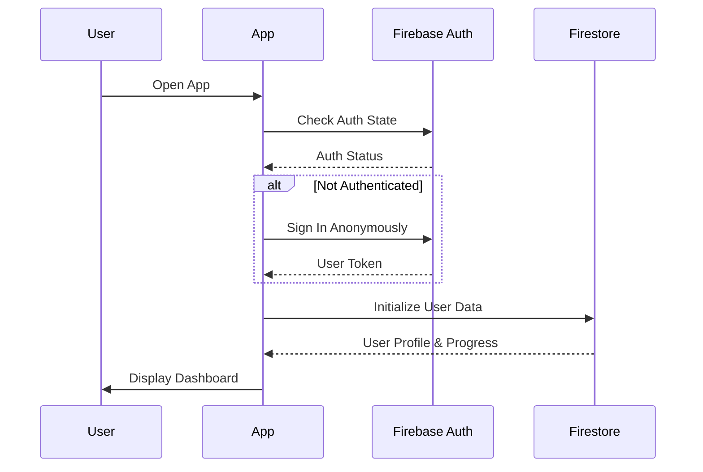
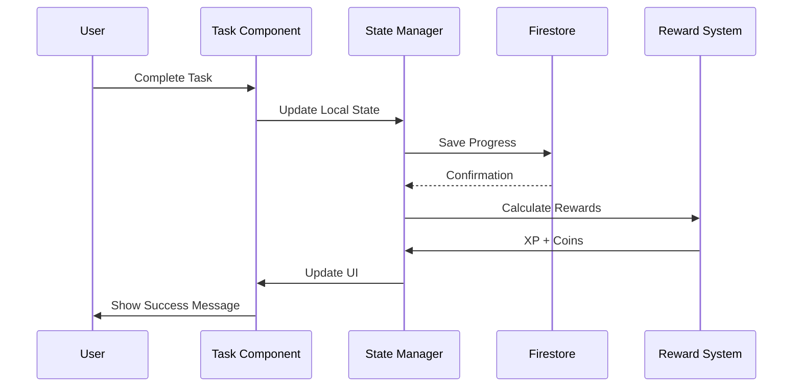
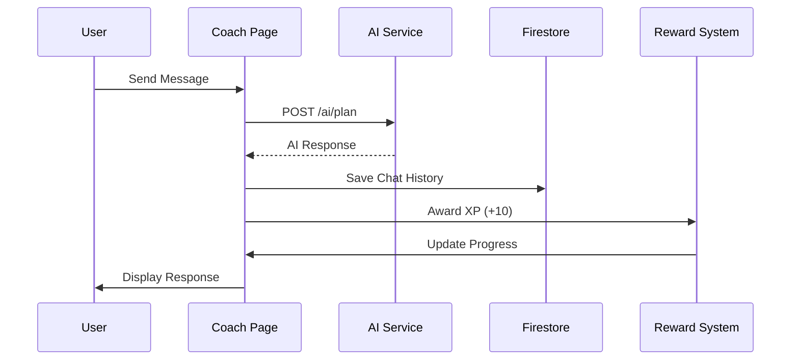
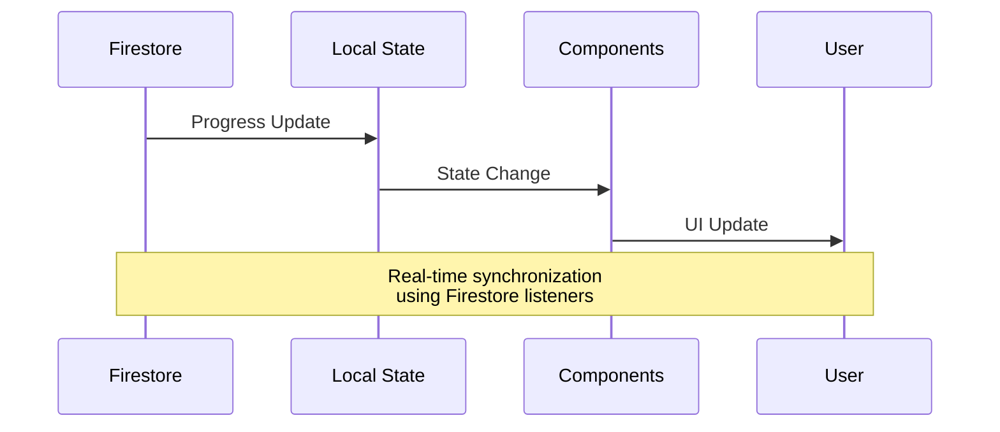

# Data Flow Architecture

## Overview
This document describes the data flow patterns in the Diet Planner Game application, following SDD principles.

## 1. User Authentication Flow



## 2. Task Completion Flow



## 3. AI Coach Interaction Flow



## 4. Real-time Progress Sync



## Data Models

### User Progress
```typescript
interface UserProgress {
  score: number;           // Total score points
  coins: number;          // Currency for unlocks
  level: number;          // Current level
  currentXP: number;      // XP towards next level
  recipesUnlocked: number; // Premium recipes owned
  hasClaimedGift: boolean; // Onboarding gift status
}
```

### Task Data
```typescript
interface Task {
  id: number;
  name: string;
  icon: IconType;
  time: string;
  completed: boolean;
  type: 'Meal' | 'Shopping' | 'Cooking';
  scoreReward: number;
  coinReward: number;
  xpReward: number;
}
```

### User Profile
```typescript
interface UserProfile {
  userName: string;
  dietType: string;
  bodyType: string;
  weight: string;
}
```

## State Management Patterns

### 1. Local State (React Hooks)
- Component-specific state
- UI interactions
- Form inputs
- Temporary data

### 2. Global State (Context)
- User progress
- Authentication status
- App-wide settings
- Navigation state

### 3. Persistent State (Firestore)
- User data
- Progress tracking
- Task history
- Chat logs

## Performance Considerations

### 1. Real-time Updates
- Use Firestore listeners efficiently
- Implement proper cleanup
- Batch updates when possible

### 2. State Optimization
- Memoize expensive calculations
- Use React.memo for components
- Implement proper dependency arrays

### 3. Data Fetching
- Implement retry logic
- Use loading states
- Handle offline scenarios

## Error Handling

### 1. Network Errors
- Retry mechanisms
- Offline fallbacks
- User notifications

### 2. Authentication Errors
- Token refresh
- Re-authentication flow
- Graceful degradation

### 3. Data Validation
- Input sanitization
- Type checking
- Error boundaries
