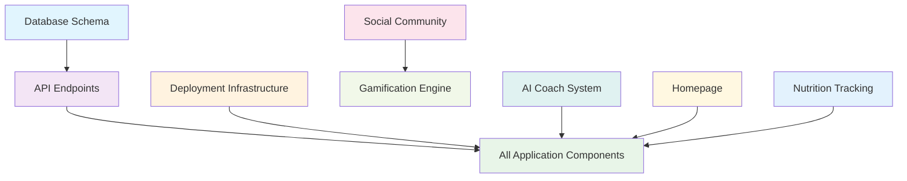

# Diet Game Specifications - Complete Guide

## 📋 Overview

This directory contains comprehensive specifications for the Diet Game application, organized into a structured folder-based format for each major component. This guide explains the new structure, how to use it effectively, and best practices for maintaining and updating specifications.

## 🚨 Current Status: Reorganization in Progress

**IMPORTANT**: We are currently reorganizing the specifications to eliminate duplication and improve maintainability. The current structure has both main files (e.g., `ai-coach-system.md`) and folders (e.g., `ai-coach-system/`) with overlapping content.

**New Structure**: We are moving to a **folder-first approach** where each specification is contained in its own folder with a README.md for navigation.

## 🏗️ Target Directory Structure

Each specification will be organized into a dedicated subdirectory containing essential files:

```
docs/specs/
├── README.md                           # This comprehensive guide
├── ORGANIZATION_PLAN.md                # Reorganization plan and status
├── diet-game-overview.md              # High-level overview (single file)
├── testing-strategy.md                # Testing strategy (single file)
│
├── ai-coach-system/                    # AI Coach System specification
│   ├── README.md                       # Overview and navigation
│   ├── requirements.md                 # What needs to be built
│   ├── design.md                       # How to build it
│   ├── tasks.md                        # Implementation plan
│   └── api-endpoints.md                # AI-specific API endpoints
│
├── api-endpoints/                      # API Endpoints specification
│   ├── README.md                       # Overview and navigation
│   ├── requirements.md                 # API requirements, constraints
│   ├── design.md                       # API architecture, authentication
│   ├── tasks.md                        # Implementation tasks, testing
│   └── endpoints/                      # Detailed endpoint specifications
│       ├── auth.md
│       ├── user-management.md
│       ├── nutrition.md
│       ├── gamification.md
│       ├── social.md
│       └── ai-coach.md
│
├── database-schema/                    # Database Schema specification
│   ├── README.md
│   ├── requirements.md
│   ├── design.md
│   ├── tasks.md
│   └── tables/                         # Individual table specifications
│       ├── users.md
│       ├── nutrition.md
│       ├── gamification.md
│       └── social.md
│
├── gamification-engine/                # Gamification Engine specification
│   ├── README.md
│   ├── requirements.md
│   ├── design.md
│   ├── tasks.md
│   └── systems/                        # Individual gamification systems
│       ├── xp-system.md
│       ├── achievements.md
│       ├── quests.md
│       └── rewards.md
│
├── nutrition-tracking/                 # Nutrition Tracking System
│   ├── README.md
│   ├── requirements.md
│   ├── design.md
│   └── tasks.md
│
├── social-community/                   # Social Community specification
│   ├── README.md
│   ├── requirements.md
│   ├── design.md
│   ├── tasks.md
│   └── features/                       # Individual social features
│       ├── friends.md
│       ├── feed.md
│       ├── challenges.md
│       └── mentorship.md
│
├── homepage/                           # Homepage specification
│   ├── README.md
│   ├── requirements.md
│   ├── design.md
│   └── tasks.md
│
└── deployment-infrastructure/          # Deployment Infrastructure
    ├── README.md
    ├── requirements.md
    ├── design.md
    └── tasks.md
```

## 🔄 Migration Status

| Component | Status | Notes |
|-----------|--------|-------|
| ai-coach-system | ✅ Complete | Folder structure ready, main file to be removed |
| api-endpoints | ✅ Complete | Folder structure ready, main file to be removed |
| database-schema | ✅ Complete | Folder structure ready, main file to be removed |
| gamification-engine | ✅ Complete | Folder structure ready, main file to be removed |
| nutrition-tracking | ⚠️ Partial | Missing tasks.md, main file to be removed |
| social-community | ✅ Complete | Folder structure ready, main file to be removed |
| homepage | ✅ Complete | Folder structure ready, main file to be removed |
| deployment-infrastructure | ✅ Complete | Folder structure ready, main file to be removed |

## 📄 File Structure Deep Dive

### 1. Requirements.md - "What to Build"
**Purpose**: Defines the business needs and functional requirements
**Audience**: Product Managers, Business Analysts, Stakeholders, QA Engineers
**Key Sections**:
- **EARS Requirements**: Easy Approach to Requirements Syntax
- **Functional Requirements**: What the system should do
- **Non-Functional Requirements**: Performance, security, usability
- **User Stories**: User-centric feature descriptions
- **Acceptance Criteria**: Measurable success conditions
- **Business Rules**: Domain-specific constraints
- **Success Metrics**: KPIs and measurement criteria

**Example Structure**:
```markdown
# [Component] Requirements

## EARS Requirements
- When [trigger], the system shall [response]
- The system shall [capability] so that [benefit]

## Functional Requirements
### FR1: [Feature Name]
- Description of what the feature does
- User stories and acceptance criteria
- Business rules and constraints

## Non-Functional Requirements
### NFR1: Performance
- Response time requirements
- Throughput requirements
- Scalability requirements
```

### 2. Design.md - "How to Build It"
**Purpose**: Defines the technical architecture and implementation approach
**Audience**: Architects, Senior Developers, Technical Leads, DevOps Engineers
**Key Sections**:
- **Architecture Overview**: High-level system design
- **Technology Stack**: Frameworks, libraries, tools
- **Data Models**: Database schemas and data structures
- **API Specifications**: Endpoints, request/response formats
- **Security Considerations**: Authentication, authorization, data protection
- **Performance Optimizations**: Caching, scaling, monitoring
- **Integration Points**: External services and dependencies

**Example Structure**:
```markdown
# [Component] Design

## Architecture Overview
- System components and their interactions
- Technology choices and rationale
- Scalability and performance considerations

## Data Models
```typescript
interface ExampleModel {
  // TypeScript interfaces and data structures
}
```

## API Endpoints
- RESTful API specifications
- Request/response examples
- Error handling strategies
```

### 3. Tasks.md - "Implementation Plan"
**Purpose**: Defines the step-by-step implementation approach
**Audience**: Development Teams, Project Managers, QA Engineers, DevOps Engineers
**Key Sections**:
- **Implementation Phases**: Organized development phases
- **Task Breakdown**: Detailed tasks with assignments and effort estimates
- **Testing Strategy**: Unit, integration, and end-to-end testing
- **Deployment Tasks**: Infrastructure setup and deployment procedures
- **Risk Mitigation**: Identified risks and mitigation strategies
- **Success Metrics**: Technical and business success criteria

**Example Structure**:
```markdown
# [Component] Tasks

## Phase 1: [Phase Name] (Sprint X-Y)
**Duration**: X weeks
**Priority**: High/Medium/Low
**Dependencies**: [List dependencies]

### Task 1.1: [Task Name]
**Assignee**: [Role]
**Effort**: X days
**Description**: [Detailed description]

**Subtasks**:
- [ ] Subtask 1
- [ ] Subtask 2

**Acceptance Criteria**:
- Criterion 1
- Criterion 2
```

## 🎯 Usage Guidelines by Role

### 👨‍💼 Product Managers
**Primary Focus**: Requirements.md
**Workflow**:
1. **Start with Requirements**: Review `requirements.md` to understand business needs
2. **Validate Design**: Check `design.md` for technical feasibility
3. **Plan Resources**: Use `tasks.md` for project planning and resource allocation
4. **Track Progress**: Monitor implementation against acceptance criteria

**Key Activities**:
- Define and refine business requirements
- Prioritize features based on business value
- Coordinate with stakeholders on acceptance criteria
- Review and approve design decisions
- Monitor project progress and milestones

### 👨‍💻 Developers
**Primary Focus**: Design.md → Tasks.md → Requirements.md
**Workflow**:
1. **Understand the Problem**: Read `requirements.md` to understand business context
2. **Study the Solution**: Review `design.md` for technical implementation details
3. **Follow the Plan**: Use `tasks.md` for step-by-step implementation
4. **Validate Requirements**: Ensure implementation meets acceptance criteria

**Key Activities**:
- Implement features according to design specifications
- Follow coding standards and best practices
- Write comprehensive tests
- Document code and technical decisions
- Participate in code reviews and design discussions

### 🧪 QA Engineers
**Primary Focus**: Requirements.md → Tasks.md → Design.md
**Workflow**:
1. **Understand Test Scenarios**: Review `requirements.md` for test cases
2. **Plan Testing Strategy**: Use `tasks.md` for testing procedures
3. **Check Technical Constraints**: Review `design.md` for testing limitations
4. **Execute Test Plans**: Follow defined testing strategies

**Key Activities**:
- Create comprehensive test plans
- Execute functional and non-functional testing
- Validate acceptance criteria
- Report and track defects
- Ensure quality gates are met

### 🔧 DevOps Engineers
**Primary Focus**: Design.md → Tasks.md → Requirements.md
**Workflow**:
1. **Infrastructure Requirements**: Focus on `design.md` for infrastructure needs
2. **Deployment Procedures**: Use `tasks.md` for deployment and monitoring setup
3. **Performance Requirements**: Reference `requirements.md` for performance needs
4. **Security Requirements**: Ensure infrastructure meets security requirements

**Key Activities**:
- Set up and maintain infrastructure
- Implement CI/CD pipelines
- Configure monitoring and alerting
- Ensure security and compliance
- Optimize performance and scalability

### 🏗️ Architects
**Primary Focus**: Design.md → Requirements.md → Tasks.md
**Workflow**:
1. **Technical Architecture**: Lead design decisions in `design.md`
2. **Validate Requirements**: Ensure design meets business requirements
3. **Guide Implementation**: Provide technical guidance for `tasks.md`
4. **Review and Approve**: Review all technical decisions and implementations

**Key Activities**:
- Define technical architecture and standards
- Make technology stack decisions
- Ensure scalability and maintainability
- Review and approve design changes
- Provide technical leadership and guidance

## 🔗 Specification Dependencies

The specifications are designed to work together with clear dependencies:



### Dependency Rules:
1. **Database Schema** must be defined before API Endpoints
2. **API Endpoints** must be defined before Application Components
3. **Deployment Infrastructure** supports all components
4. **Social Community** depends on Gamification Engine
5. **AI Coach System** integrates with all user-facing components

## 📝 Maintenance and Updates

### When to Update Specifications

#### Requirements.md Updates
- ✅ New business requirements or feature requests
- ✅ Changes in user needs or market conditions
- ✅ Regulatory or compliance changes
- ✅ Performance or security requirement changes
- ❌ Technical implementation details (use Design.md)

#### Design.md Updates
- ✅ Technology stack changes
- ✅ Architecture modifications
- ✅ New integration requirements
- ✅ Security or performance optimizations
- ❌ Business requirements (use Requirements.md)

#### Tasks.md Updates
- ✅ Implementation approach changes
- ✅ New development phases or milestones
- ✅ Resource allocation changes
- ✅ Testing strategy modifications
- ❌ Business requirements (use Requirements.md)

### Update Process

#### 1. Change Identification
```markdown
## Change Request Template
**Component**: [Specification Name]
**File**: [requirements.md/design.md/tasks.md]
**Change Type**: [New Feature/Bug Fix/Enhancement/Refactor]
**Priority**: [High/Medium/Low]
**Impact**: [Description of impact]
**Dependencies**: [List affected specifications]
```

#### 2. Impact Analysis
- Review all dependent specifications
- Identify affected stakeholders
- Assess implementation impact
- Estimate effort and timeline

#### 3. Update Execution
- Update the relevant specification file
- Review and update dependent specifications
- Update project documentation
- Communicate changes to stakeholders

#### 4. Validation
- Review changes with stakeholders
- Validate technical feasibility
- Ensure consistency across specifications
- Update project timelines

### Version Control Best Practices

#### Semantic Versioning
```markdown
## Version Format: MAJOR.MINOR.PATCH
- MAJOR: Breaking changes or major feature additions
- MINOR: New features or significant enhancements
- PATCH: Bug fixes or minor updates

## Examples:
- v1.0.0: Initial specification release
- v1.1.0: Added new feature requirements
- v1.1.1: Fixed typo in acceptance criteria
- v2.0.0: Major architecture change
```

#### Change Log Template
```markdown
# Changelog

## [Version] - YYYY-MM-DD
### Added
- New features or requirements

### Changed
- Modified existing features

### Deprecated
- Features to be removed

### Removed
- Deleted features

### Fixed
- Bug fixes

### Security
- Security improvements
```

## 🎯 Best Practices

### Writing Effective Specifications

#### Requirements.md Best Practices
- ✅ Use clear, unambiguous language
- ✅ Include concrete examples and use cases
- ✅ Define measurable acceptance criteria
- ✅ Use EARS (Easy Approach to Requirements Syntax)
- ✅ Include business context and rationale
- ❌ Avoid technical implementation details
- ❌ Don't include design decisions

#### Design.md Best Practices
- ✅ Use diagrams and visual representations
- ✅ Include code examples and configurations
- ✅ Document technology choices and rationale
- ✅ Consider scalability and maintainability
- ✅ Include security and performance considerations
- ❌ Avoid business requirements
- ❌ Don't include implementation timelines

#### Tasks.md Best Practices
- ✅ Break down tasks into manageable chunks
- ✅ Include effort estimates and dependencies
- ✅ Define clear acceptance criteria
- ✅ Include testing and validation steps
- ✅ Consider risk mitigation strategies
- ❌ Avoid business requirements
- ❌ Don't include design decisions

### Review Process

#### Review Checklist
```markdown
## Specification Review Checklist

### Requirements.md
- [ ] Requirements are clear and unambiguous
- [ ] Acceptance criteria are measurable
- [ ] Business context is provided
- [ ] User stories are complete
- [ ] Success metrics are defined

### Design.md
- [ ] Architecture is well-documented
- [ ] Technology choices are justified
- [ ] Security considerations are addressed
- [ ] Performance requirements are met
- [ ] Integration points are defined

### Tasks.md
- [ ] Tasks are properly broken down
- [ ] Dependencies are identified
- [ ] Effort estimates are realistic
- [ ] Testing strategy is comprehensive
- [ ] Risk mitigation is addressed
```

#### Review Roles
- **Business Review**: Product Manager, Business Analyst
- **Technical Review**: Architect, Senior Developer
- **Implementation Review**: Development Team Lead
- **Quality Review**: QA Lead
- **Security Review**: Security Engineer

### Consistency Guidelines

#### Naming Conventions
- Use consistent terminology across all specifications
- Define acronyms and technical terms
- Use standard industry terminology
- Maintain consistent file naming

#### Formatting Standards
- Use consistent markdown formatting
- Include table of contents for long documents
- Use consistent heading hierarchy
- Include cross-references between files

#### Content Standards
- Keep specifications focused and concise
- Include relevant examples and use cases
- Maintain traceability between requirements and tasks
- Update all related specifications when making changes

## 🚀 Getting Started

### For New Team Members

#### Week 1: Foundation
1. **Read this README.md** for complete overview
2. **Review Requirements**: Read all `requirements.md` files to understand business needs
3. **Study Architecture**: Review `design.md` files to understand technical approach
4. **Understand Implementation**: Skim `tasks.md` files to understand development plan

#### Week 2: Deep Dive
1. **Focus on Your Area**: Deep dive into specifications relevant to your role
2. **Understand Dependencies**: Review how your work connects to other components
3. **Ask Questions**: Schedule time with team leads to clarify any questions
4. **Start Contributing**: Begin working on tasks with guidance from experienced team members

### For Starting a New Feature

#### Planning Phase
1. **Identify Scope**: Determine which specifications are affected
2. **Review Current State**: Read existing requirements and design
3. **Plan Implementation**: Use existing tasks as templates for new work
4. **Coordinate Dependencies**: Ensure all dependent work is planned

#### Development Phase
1. **Follow the Plan**: Use tasks.md as your implementation guide
2. **Update Specifications**: Keep specifications current as you learn
3. **Validate Requirements**: Ensure implementation meets acceptance criteria
4. **Document Changes**: Update specifications with any new insights

### For Project Planning

#### Sprint Planning
1. **Use Tasks.md**: Reference task breakdown for sprint planning
2. **Check Dependencies**: Ensure all prerequisite work is completed
3. **Validate Acceptance Criteria**: Use requirements.md for sprint goals
4. **Coordinate Teams**: Ensure cross-team dependencies are managed

#### Release Planning
1. **Review All Specifications**: Ensure all components are ready
2. **Validate Integration**: Check that all components work together
3. **Plan Deployment**: Use deployment-infrastructure tasks for release planning
4. **Prepare Support**: Ensure support teams understand the new features

## 🆘 Support and Troubleshooting

### Common Questions and Answers

#### Q: Which file should I update for a new feature request?
**A**: Start with `requirements.md` to define what needs to be built, then update `design.md` if technical changes are needed, and finally update `tasks.md` with implementation details.

#### Q: How do I handle changes that affect multiple specifications?
**A**: Update the primary specification first, then review and update all dependent specifications. Use the dependency diagram to identify affected components.

#### Q: What if requirements and design conflict?
**A**: Requirements take precedence. Update the design to meet the requirements, or clarify the requirements if the design reveals issues.

#### Q: How detailed should tasks be?
**A**: Tasks should be detailed enough for a developer to implement without additional clarification, typically 1-3 days of work each.

#### Q: When should I create a new specification vs. updating an existing one?
**A**: Create a new specification for a major new component. Update existing specifications for enhancements or modifications to current components.

### Getting Help

#### Technical Questions
- **Architecture**: Consult the relevant `design.md` file
- **Implementation**: Check the appropriate `tasks.md` file
- **Business Context**: Review the corresponding `requirements.md` file

#### Process Questions
- **Specification Updates**: Follow the maintenance process outlined above
- **Review Process**: Use the review checklist and guidelines
- **Dependencies**: Reference the dependency diagram and rules

#### Cross-Specification Questions
- **Integration Points**: Review all related `design.md` files
- **Dependencies**: Check the dependency diagram
- **Coordination**: Schedule time with relevant team leads

## 📊 Success Metrics

### Specification Quality Metrics
- **Completeness**: All required sections are present and filled
- **Clarity**: Requirements are unambiguous and measurable
- **Consistency**: Terminology and format are consistent across files
- **Traceability**: Clear links between requirements, design, and tasks
- **Accuracy**: Specifications reflect current system state

### Process Metrics
- **Update Frequency**: Specifications are updated regularly
- **Review Coverage**: All changes are reviewed by appropriate stakeholders
- **Stakeholder Satisfaction**: Team members find specifications useful
- **Implementation Success**: Features are delivered according to specifications
- **Defect Rate**: Low number of defects due to specification issues

### Business Impact Metrics
- **Development Velocity**: Faster development with clear specifications
- **Quality Improvement**: Fewer defects and rework
- **Stakeholder Alignment**: Better understanding of requirements
- **Risk Reduction**: Fewer surprises during implementation
- **Knowledge Transfer**: Easier onboarding of new team members

## 🔄 Continuous Improvement

### Regular Reviews
- **Monthly**: Review specification usage and effectiveness
- **Quarterly**: Assess specification quality and completeness
- **Annually**: Evaluate overall specification process and tools

### Feedback Collection
- **Developer Feedback**: How useful are specifications for implementation?
- **Product Feedback**: Do specifications capture business needs accurately?
- **QA Feedback**: Are specifications sufficient for testing?
- **Stakeholder Feedback**: Do specifications provide clear understanding?

### Process Evolution
- **Tool Improvements**: Better templates, automation, and tooling
- **Process Refinements**: Streamlined review and update processes
- **Training Enhancements**: Better onboarding and training materials
- **Best Practices**: Continuous improvement of writing and review practices

---

## 📞 Contact and Support

For questions about specifications:
- **Technical Questions**: Consult the relevant `design.md` file
- **Business Questions**: Review the corresponding `requirements.md` file
- **Implementation Questions**: Check the appropriate `tasks.md` file
- **Process Questions**: Reference this README and established guidelines
- **Cross-Specification Questions**: Review dependency diagrams and coordinate with team leads

Remember: Specifications are living documents that should evolve with the project. Keep them current, clear, and useful for all team members.